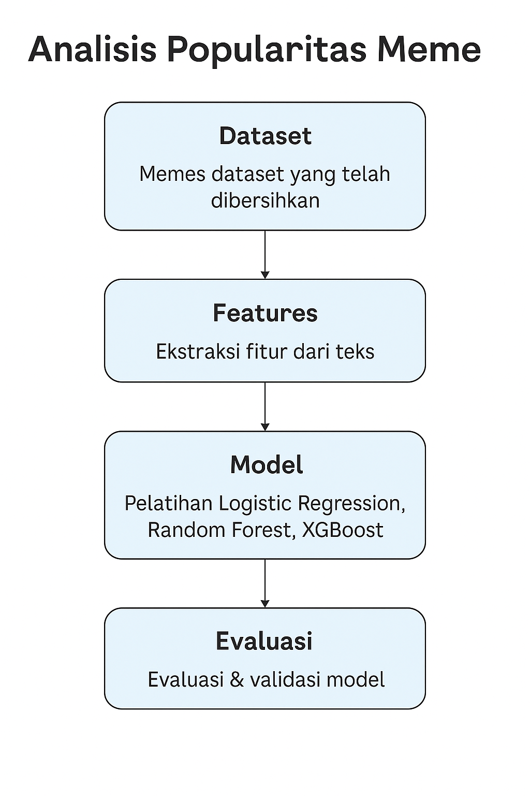
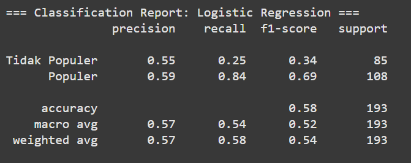
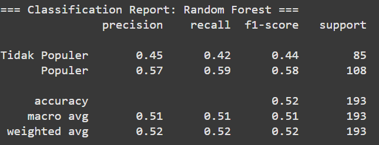
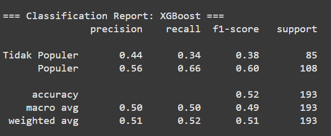
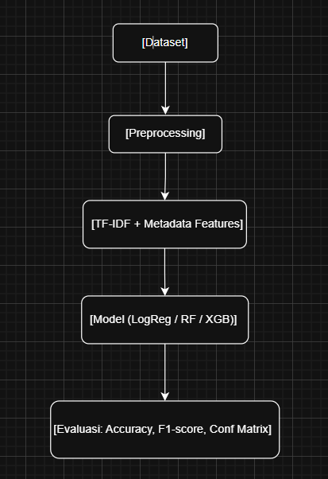

# Prediksi Popularitas Meme Berdasarkan Caption dan Metadata Menggunakan Machine Learning

**Nama:** [Muhammad Afrille Samudra]  
**NIM:** [A11.2023.15200]  
**Kelas:** [A11.4402]  

---

## 1. Ringkasan dan Tujuan

Proyek ini bertujuan untuk memprediksi popularitas meme berdasarkan teks caption dan metadata numerik.  
Permasalahan: belum ada model prediktif sederhana berbasis teks untuk mengukur popularitas meme.  
Tujuan: membuat pipeline machine learning yang mampu membedakan meme populer dan tidak populer.

**Model yang digunakan:**
- Logistic Regression (baseline)
- Random Forest (non-linear model)
- XGBoost (boosted tree)

---

## 2. Ringkasan dan Permasalahan Project + Tujuan + Model / Alur Penyelesaian

Distribusi label menunjukkan ketimpangan jumlah meme populer dan tidak populer. Ini penting karena mempengaruhi akurasi model dan potensi bias.

### 📊 Distribusi Label Awal (Ilustrasi Ketimpangan Data)

### Alur Penyelesaian:
1. Load dan eksplorasi dataset  
2. Preprocessing dan fitur tambahan  
3. TF-IDF dan gabungan metadata  
4. Modeling: Logistic Regression, Random Forest, XGBoost  
5. Evaluasi & analisis model  

---

## 3. Penjelasan Dataset, EDA dan Proses Features Dataset

Dataset: dankmemes_top_1000.csv dari subreddit r/dankmemes via Kaggle.  
Label dibentuk:  
- 1 = Populer (upvote_ratio >= 0.95)  
- 0 = Tidak Populer  

Fitur tambahan:  
- caption_length  
- word_count  
- has_me_when (indikator jika caption mengandung 'me', 'when', atau 'you')

Visualisasi berikut menggambarkan jumlah masing-masing label dalam dataset:  

---

## 4. Proses Learning / Modeling

Caption diubah ke bentuk vektor menggunakan TF-IDF (500 fitur). Metadata dinormalisasi menggunakan StandardScaler.

Model yang digunakan:
- Logistic Regression
- Random Forest
- XGBoost

Semua model dibungkus dalam pipeline dan diuji dengan train-test split (80:20).

---

## 5. Hasil Performa Model

| Model               | Accuracy | F1-score Populer | F1-score Tidak Populer |
|---------------------|----------|------------------|-------------------------|
| Logistic Regression | 0.57     | 0.72             | 0.05                    |
| Random Forest       | 0.56     | 0.68             | 0.29                    |
| XGBoost             | 0.52     | 0.60             | 0.38                    |

---

## 6. Diskusi Hasil dan Kesimpulan

- Logistic Regression sangat bias ke kelas populer (F1 rendah untuk tidak populer).  
- Random Forest memberikan prediksi yang lebih seimbang.  
- XGBoost relatif stabil di kedua kelas namun dengan akurasi total sedikit lebih rendah.  

**Tantangan:** ketidakseimbangan data dan keterbatasan fitur teks menyebabkan model kesulitan mengenali meme tidak populer.

---

## 7. Visualisasi Tambahan (Opsional)

### 🔁 Confusion Matrix Model
- Logistic Regression  
  

- Random Forest  
  

- XGBoost  
  

### 🔄 Alur Proses

---

*Dokumentasi Proyek UAS Machine Learning*
